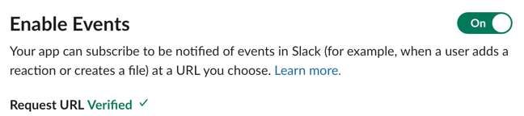

# Slack-Bot-OpenAI-Cortex
Slack Bot who can generate Cortex XDR XQL query 

## Generate OpenAI API Token
Register an account and generate OpenAI API Token here https://beta.openai.com/account/api-keys

## Create a Slack app in your workspace 
- Go to https://api.slack.com/
- Click on **Create New App**
- Click on **From scratch**, then name it something fancy and select your workspace
- Go to **App Home** > **Review Scope to Add** > Select **chat:write**
- Now click **Install to Workspace** then copy the **Bot User Oauth Token** to somewhere safe first
- Go to **App Home** and enable "Allow users to send Slash commands and messages"

- Go to **Basic Information** then copy the **Signing secret**


## Create .env file in your project folder
- Clone this repo
- Create a new .env file under the same folder path with slack_bot.py
- Add these 3 lines with your OpenAI API Key, Slack token and signing secret
```
export SLACK_TOKEN=<token here>
export SIGNING_SECRET=<secret here>
export OPENAI_API_KEY=<api key here>
```

## It's not ready yet. Now you run the application for the first time to finish Slack app configuration
- Run the script in a server with public inbound IP because slack_bot will now listen to port 5000 on the server
- You will need to add the server's URL/IP address to Slack so Slack can send message to slack_bot program when there's a new message send to the Slack Bot App.
```
$ docker-compose up -d
$ docker container ls | grep xql
87c4598020e7   xql-openai_xql_bot                     "sh -c 'python3 slac…"   59 seconds ago   Up 3 seconds             0.0.0.0:5000->5000/tcp, :::5000->5000/tcp   xql_bot
```
- Go to **Slack API** > **Event Subscription** then select **Enable Events**
- Put your URL to the Request URL field:
```
http://<your-public-ip-or-url>:5000/slack/events
```
- Make sure Slack can verify it. Slack will POST a challenge message to this URL, then our slack_bot app will respond with a correct message because of the Signing secrect we configured earlier.

- At this stage, Slack will ask you to Install the App to Workspace again because it has been added some new permissions. Just install the app again, your token will still be the same but there are new Oauth permissions added.

## Now the setup is done. You can go to Slack and test the Bot by asking it questions and see the result from OpenAI


## Have more data to train?
- More data (instruction and completion set) can be appended to the `instruction_query_pairs.csv` file. 
- Run `python3 create_index.py` to reindex the new data set

## Using Web UI
If you don't want to use this Bot as a Slack Bot at the moment but only need to test around, you can launch it as a Web UI tool by accessing your server address (http://server-url:5000/)


